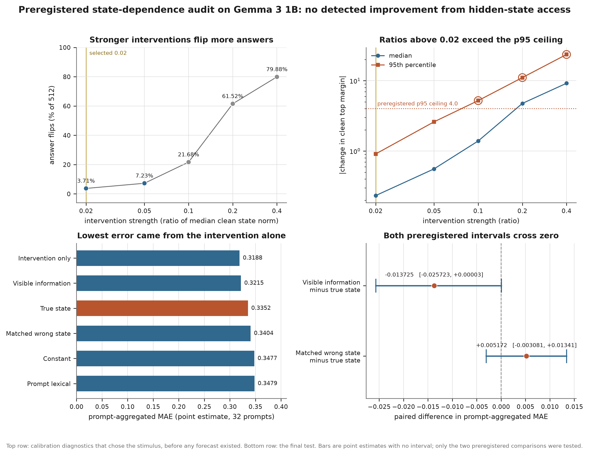
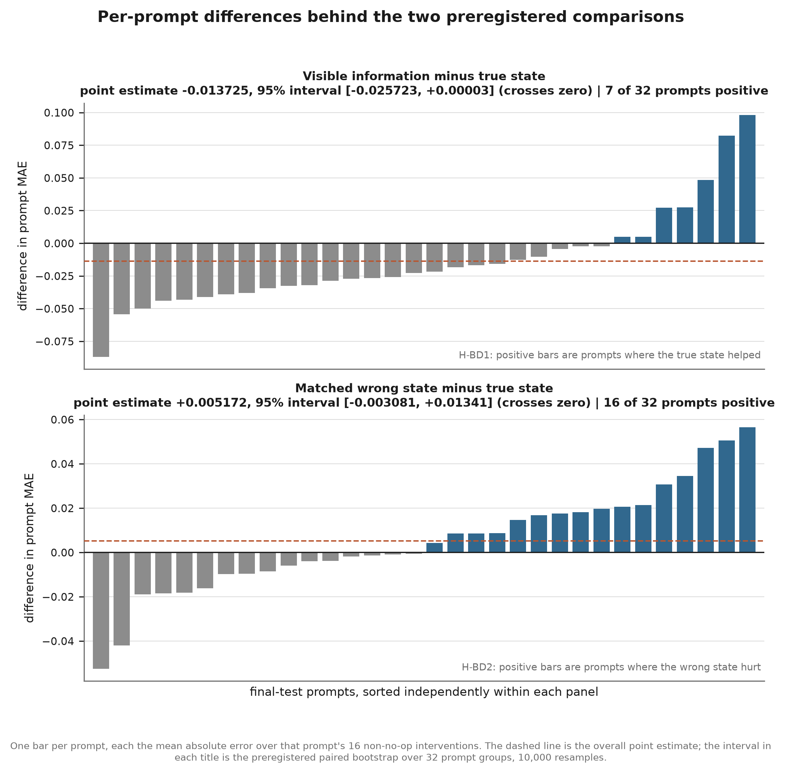

# causal-self-forecasting

**Does a language model's hidden state carry information about what an intervention will do to its
answer, beyond what you can already read off the prompt and the output?**

This is a **precommitted benchmark** for forecasting what an activation intervention will do before
applying it, plus a first application that returns a null. We add a fixed vector to layer 13 of
`google/gemma-3-1b-it` on ARC-Challenge prompts and measure how far it shifts the margin around the
model's own preferred answer. Three ridge regressions were fitted on 96 prompts and frozen; all
three see an identical numerical description of the intervention, one also sees the prompt and clean
logits, and one also sees the model's actual hidden state. Every prediction for the 32 held-out
prompts was sealed under a salted hash before a single final-test intervention ran. **Under this
setup, no improvement from state access was detected.**

Training and the final test share one fixed family of 16 signed interventions, so no method was
asked to generalize to an intervention it had not seen.

## Result

Absolute errors are averaged within each prompt first, then across the 32 prompts. All values are
point estimates; only the two comparisons below carry intervals.

| Method | MAE | RMSE | Sign accuracy | Spearman |
| --- | --: | --: | --: | --: |
| Intervention only | 0.318821 | 0.402262 | 0.630859 | 0.357776 |
| Visible information | 0.321518 | 0.404996 | 0.630859 | 0.353763 |
| True state | 0.335244 | 0.421573 | 0.580078 | 0.296136 |
| Matched wrong state | 0.340416 | 0.426767 | 0.566406 | 0.183944 |



**Claim boundary.** This is an external audit in which we fit the predictors, so it measures one
linear readout of one layer of one 1B model on 32 prompts; it is not evidence of equivalence, and it
says nothing about introspection, self-report, faithful reasoning, hidden goals, or larger models.

## Primary comparisons

Two preregistered comparisons, 10,000 paired bootstrap resamples over the 32 prompt groups, seed
`1394099119`. Both intervals cross zero, so neither hypothesis is supported.

| Comparison | Point estimate | 95 percent interval | Verdict |
| --- | --: | --- | --- |
| Visible minus true-state MAE | -0.013725 | [-0.025723, 0.00003] | crosses zero, H-BD1 not supported |
| Matched wrong-state minus true-state MAE | 0.005172 | [-0.003081, 0.013412] | crosses zero, H-BD2 not supported |



The complete figure gallery, including the calibration dose response, predicted-against-observed
scatter, and state-specificity controls, is in [`paper/figures/`](paper/figures) and is regenerated
from the bundle by `uv run csf state-audit plot-bundle --bundle results/public/bluedot-v0.1 --output paper/figures`.

## Install

Python 3.12 and [uv](https://docs.astral.sh/uv/). No GPU. The test suite is fully offline and never
downloads weights.

```powershell
uv sync --extra dev --extra torch
```

## Replay the result

The published bundle is self-contained. Nothing outside it is read, and no model is loaded.

```powershell
uv run csf state-audit replay-bundle --bundle results/public/bluedot-v0.1
```

Expect `valid: true`, `checksums_valid: true`, 22 checksums, 16 conditions, 2 comparisons, zero
failures, and `analysis_hash`
`sha256:46e88d3a629c78009787f88fadc5c821e8c318e3ee301923a236171cde1ece4d`.

The checksum file is in the format the ordinary tool accepts, so the bundle can also be checked with
no Python at all:

```powershell
cd results/public/bluedot-v0.1; sha256sum -c CHECKSUMS.sha256
```

## Read more

| Document | What it is |
| --- | --- |
| [`REPORT.md`](REPORT.md) | The technical report: full design, calibration, integrity record, limitations, and artifact inventory |
| [`paper/main.tex`](paper/main.tex) | The workshop paper |
| [`protocol/preregistration_state_dependence.md`](protocol/preregistration_state_dependence.md) | The preregistration, committed once and never modified |
| [`protocol/README.md`](protocol/README.md) | Provenance for every frozen artifact, with commit dates and hashes |
| [`results/public/bluedot-v0.1/`](results/public/bluedot-v0.1) | The replay bundle: analysis, outcomes, sealed forecasts, commitments, reveals, score tables, calibration observations |

Reproducing the study from scratch, including the ordered stage commands and their costs, is
documented in [`REPORT.md`](REPORT.md). Start from the release tag rather than `main`:

```powershell
git checkout v0.1.0
```

## Repository structure

```text
configs/          pinned model, task, prompt, direction, calibration, and run configs
data/             frozen manifests: prompt split, direction family, calibration plan, projection
paper/            workshop paper, bibliography, publication figures
protocol/         preregistration and execution decision tree, with commit provenance
results/public/   the model-free replay bundle
src/              the csf package
tests/            unit, integration, and the anti-fabrication guard
```

## Citation and license

See [`CITATION.cff`](CITATION.cff). Please cite the software and the null result, and please do not
cite it as evidence that models lack privileged access to their own states, which is a much larger
claim than this experiment can carry.

MIT, see [`LICENSE`](LICENSE). Gemma weights are not redistributed and remain under Google's license.
