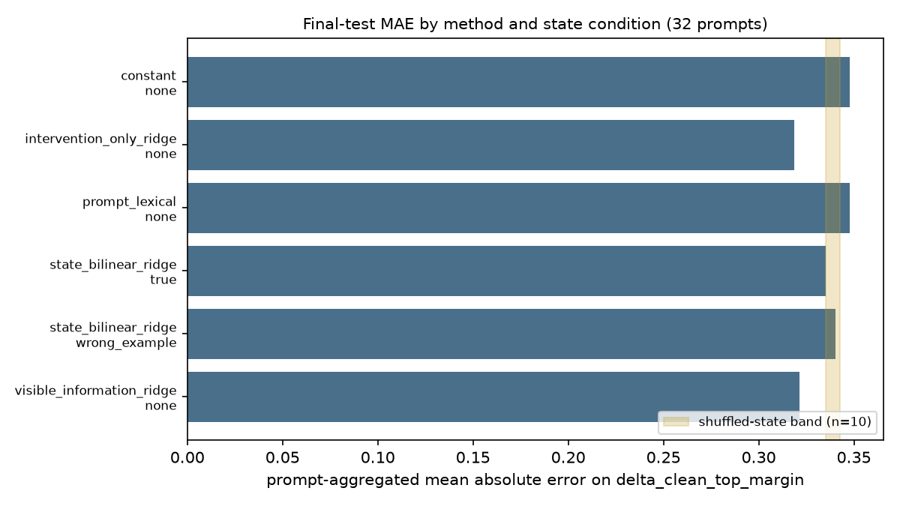
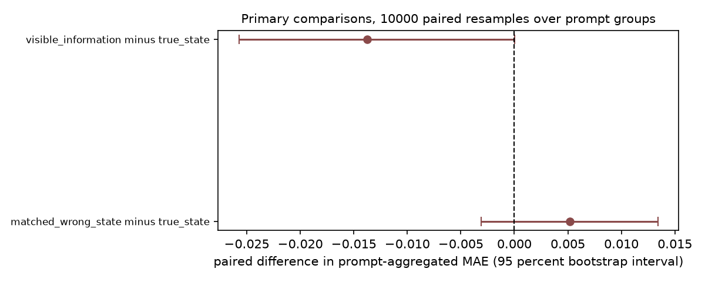

# Testing Prompt-Specific Hidden-State Access for Intervention-Effect Forecasting

A preregistered null result in Gemma 3 1B.

Jacob Ortiz. Study id `bluedot_state_dependence`. Resolved 2026-07-30.

---

## Summary

We asked whether a language model's own hidden state carries information about the effect of an
activation intervention that is not already available from the prompt, the model's clean output
distribution, and a complete numerical description of the intervention itself.

**Under this setup, no improvement from state access was detected.** That is the finding, and it is
deliberately narrower than "the state carries nothing."

Three ridge regressions were fitted on 96 training prompts and then frozen. All three received an
identical 16-dimensional numerical encoding of the intervention. One received nothing else. One
also received the prompt text and the clean output distribution. The third also received a
compressed version of the model's actual layer-13 residual stream for that prompt, together with
its interaction with the intervention encoding. Every prediction for all 32 final-test prompts was
committed under a salted hash before a single final-test intervention was applied.

When the interventions were run, the state-conditioned model did not beat the visible-information
model by a detectable margin, and replacing the true hidden state with another prompt's state did
not degrade it by a detectable margin. The lowest point-estimate error belonged to the simplest
model: the intervention encoding alone.

Both preregistered hypotheses are unsupported. Under the decision rule fixed in advance, an interval
crossing zero is a null result and is not reported as a trend. It is also not a demonstration of
equivalence: no equivalence bound was preregistered, no power analysis was run, and with 32 prompt
groups the intervals are wide enough to be consistent with a small true effect in either direction.

## The question, stated precisely

Take a small instruction-tuned model answering a four-choice science question. At one layer, at
the final prompt token, add a fixed unit vector scaled by a fixed strength to the residual stream.
Let the forward pass finish. Measure how far the margin around the model's own clean preferred
answer moved.

Call that quantity `delta_clean_top_margin`. It is defined against the model's own clean
preference, held fixed after the intervention, not against the dataset's answer key. Whether the
model was right about the science is irrelevant to the measurement.

Now try to predict that number in advance, for an intervention that has not been applied yet.

Two predictors get the same job and the same intervention description. Only one of them also sees
the model's hidden state. If the state-conditioned predictor wins, the residual stream held
something about the intervention's consequences that the visible inputs did not. If it does not
win, then under this setup no improvement from state access was detected, which is a weaker
statement than showing there is none to find.

A second hypothesis makes the first one mean something. Suppose the state-conditioned predictor
does win. Is it using *this prompt's* state, or merely *a* state, as a source of variance that
happens to help? To find out, swap in the hidden state of a different, deliberately similar
final-test prompt and re-score without refitting. If performance survives the swap, the win was
not about prompt-specific state information and the claim collapses.

Formally:

* **H-BD1.** The state-conditioned ridge achieves lower prompt-aggregated mean absolute error on
  `delta_clean_top_margin` than the visible-information ridge.
* **H-BD2.** That advantage depends on the state belonging to the prompt being predicted, so
  substituting a matched wrong state raises the error.

Both had to go the right way. Neither did.

### What this is not

This is an **external state-information audit**. The predictors are ridge regressions that we fit
and control. A ridge regression reading a residual stream is a readout, not a report, and the model
is not the thing doing the reporting. It is never asked about itself, and it produces no text about
its own internals.

Nothing here tests, and no number from it may be described as testing, introspection,
consciousness, self-awareness, faithful verbal reasoning, hidden goals, deception, or deployment
readiness.

## Design

| Item | Value |
| --- | --- |
| Model | `google/gemma-3-1b-it`, revision `dcc83ea841ab6100d6b47a070329e1ba4cf78752` |
| Precision | CPU float32, hidden dimension 1152 |
| Task | ARC-Challenge, four choices, one neutral prompt wrapper |
| Prompt split | 168 prompts: 8 smoke, 32 calibration, 96 training, 32 final test |
| State | Residual stream at the final prompt token, layer 13 |
| Target | `delta_clean_top_margin` |
| Directions | 8 unit vectors: 4 centered answer-token unembedding directions, 4 seeded random controls orthogonal to their span and to each other |
| Candidates | 17 per prompt: 8 directions x 2 signs, plus one no-op |
| Strength | One global alpha, `ratio * median clean state norm over the calibration prompts` |
| Selected ratio | 0.02 |
| Global alpha | 106.87158268272867 |
| Methods | Ridge regressions only, plus two diagnostics |
| Primary control | Deterministic nearest matched wrong state |
| Secondary control | Ten seeded deranged state permutations |
| Analysis | Prompt-first aggregation, 10,000 paired bootstrap resamples over prompt groups |

The split is disjoint by item and by group, drawn deterministically from 256 eligible ARC groups by
a seeded permutation of group ids. Selection never reads correctness, confidence, logits, or hidden
states, so the split cannot have been chosen to suit a result.

Three design choices carry most of the weight.

**The intervention strength is global, not prompt-relative.** Every method is told the
intervention's operation, layer, position, and strength. If the strength were
`ratio * ||h_prompt||`, the visible-information baseline would silently be handed the prompt's own
state norm, and the exact comparison this study exists to make would be contaminated at the source.
There is no prompt-specific strength function anywhere in the code, and a verifier refuses a set of
observations that used more than one alpha at a grid point.

**Semantic direction labels are hidden; the numerical vectors are not.** A real answer-token steer
and a matched random control are published to the predictors with the same operation, layer,
position, and strength, and a meaningless identifier. The record type refuses an identifier that
names a construction role, an answer label, or a family.

This is blinding of the *label*, not of the *vector*. Every method receives `P^T v`, a fixed
16-dimensional projection of the same 1152-dimensional vector that gets added to the residual
stream, so a predictor can tell the eight directions apart numerically and could in principle learn
structure that happens to correlate with construction role. What it cannot do is read "this one is
the steer toward answer B" off the metadata and discount the controls without consulting anything
else. The blinding rules out one specific shortcut; it is not an information-theoretic guarantee.

**Thresholds were frozen before any number existed.** The calibration plan fixed the target, the
five candidate ratios, the two permitted layers, and six pass conditions, and the calibration run
was judged against the plan rather than against anything it measured.

## Choosing the intervention strength

An intervention study needs a stimulus that is large enough to produce a measurable effect and
small enough not to destroy the computation. That choice must not be made by looking at which
strength produces the nicest result.

The calibration stage ran the 32 calibration prompts at all five preregistered ratios: 2,624
forward passes, 2,592 observations, zero failures. All clean states were captured first, their
median norm taken as the reference, and one global alpha derived per ratio before any intervention
ran. The selector then took the **smallest** ratio that passed every condition, in preregistered
order.

Ratio 0.02 was the smallest passing strength:

| Quantity | Value |
| --- | --- |
| Non-no-op observations | 512 |
| Failures | 0 |
| Answer flips | 19 (3.71 percent) |
| Observations with absolute effect at least 0.10 | 394 of 512 (76.95 percent) |
| Median absolute effect | 0.23317 |
| p95 absolute effect | 0.91024 |
| Maximum absolute no-op target | exactly 0 |

Ratios 0.10, 0.20, and 0.40 failed, and each of them failed on exactly one condition: the
preregistered p95 ceiling of 4.0, at 5.22, 11.08, and 23.58 respectively. Ratio 0.05 also passed
every condition; 0.02 was selected because it is smaller, not because it looked better. The
layer-20 fallback was therefore prohibited, because the primary layer produced a usable ratio.

One diagnostic from calibration is worth stating up front, because it constrains what a positive
result could have meant. At the selected strength the four centered answer-token directions and the
four random orthogonal controls flipped the model's answer at nearly the same rate: 10 flips in 256
against 9 in 256, or 3.91 percent against 3.52 percent. The same holds in training, 22 in 768
against 23 in 768. The answer-token directions are constructed from the unembedding, but at this
strength they are not behaving like a privileged causal handle relative to random directions of
equal norm.

## Predictors

All predictors are ridge regressions or trivial diagnostics. Nothing is a neural network, nothing
is fine-tuned, and no adapter is trained.

Every method receives the same intervention block: `P^T v`, where `v` is the 1152-dimensional
intervention vector and `P` is a fixed 1152x16 projection generated once from the master seed. `P`
is never fitted. It is generated before any outcome exists and cited by hash from every forecast.

The four feature blocks:

| Block | Width | Contents |
| --- | --- | --- |
| Intervention | 16 | `P^T v`. Identical across every method. |
| Visible | 39 | Four centered clean answer logits, clean top margin, clean entropy, prompt token count, and 32 train-only TF-IDF plus truncated-SVD components of the prompt text. |
| State | 16 | Train-only PCA of the 1152-dimensional clean residual stream. |
| Interaction | 256 | Flattened outer product of the state block and the intervention block. |

The three ridges:

| Method | Blocks | Dimension | Ridge alpha | Training-fold CV MAE |
| --- | --- | --: | --: | --: |
| Intervention-only | intervention | 16 | 100 | 0.338847 |
| Visible-information | intervention, visible | 55 | 1000 | 0.343321 |
| State bilinear | intervention, visible, state, interaction | 327 | 10000 | 0.361691 |

Ridge alphas were selected by six-fold grouped cross-validation over a fixed eight-point grid,
grouping by prompt so that no fold ever scored a prompt it was fitted on. The state bilinear model
selected the largest alpha on the grid, 10000, which is a grid-edge selection and is recorded as
such: the cross-validation wanted more regularization than the grid offered.

Two model-free diagnostics were also committed: a **constant** predictor that emits the training
mean, and a **prompt lexical** predictor that regresses on bag-of-words features of the prompt text
and never sees the intervention at all. They exist to locate the floor.

The TF-IDF vectorizer, the SVD, the state PCA, and the feature standardizer were all fitted on the
96 training prompts only, on 1,536 rows, and every fit record carries the list of prompt ids it saw
and a hash of that list. A transform record refuses to be constructed with a fit role other than
`training`.

Two isolation rules make the substitution controls meaningful. The visible block contains no
state-derived quantity, and no semantic direction label reaches any model. And the wrong-state and
shuffled-state conditions change **only** the state block and the interaction block; the
intervention and visible blocks are byte-identical to the true-state condition. Whatever difference
those conditions produce is attributable to the state and nothing else.

## The matched wrong-state control

For each final-test prompt, a donor is chosen deterministically from the other 31 final-test
prompts: the nearest one by clean top margin and clean entropy, restricted to donors sharing the
model's clean preferred label. No prompt is its own donor. All 32 matches share the preferred
label; the median margin distance between a prompt and its donor is 0.27.

The point of matching is to make the substitution hard to detect for the wrong reason. An
arbitrary donor state would differ from the true state in gross, easily separable ways. A donor
matched on the visible output distribution differs mainly in what makes it a *different prompt*.

Ten additional shuffled conditions apply seeded derangements over the 32 prompts, so no prompt
keeps its own state in any of them. These give an empirical band for "what a state-conditioned
model scores when the state is wrong on purpose."

## Precommitment

The credibility of a forecasting study rests on the forecasts existing before the outcomes. This
one enforces that mechanically rather than by assertion.

Before any final-test intervention ran, the 32 final-test prompts were pushed through a clean-only
stage: 32 clean forwards, zero interventions, capturing clean logits and layer-13 states. The
manifest for that stage carries `intervention_count` as a typed literal zero, so a run that applied
an intervention cannot be recorded as a clean stage.

All predictors and transforms were then frozen, all conditions built, and every forecast committed:
**512 commitment records**, one for each of 16 method-and-condition combinations on each of the 32
prompts.

**Each of the 512 records covers all 17 candidates for its prompt.** A record is not a prediction
about one intervention; it holds 17 candidate forecasts, each with a predicted margin shift, a 5-95
interval, and a flip probability. The 512 sealed records therefore contain 512 x 17 = 8,704
candidate-level predictions. Nothing was committed at one granularity and scored at another: the
no-op is committed alongside the 16 signed interventions, and scoring reads the same 17 back.

| Condition | Commitments |
| --- | --: |
| `constant:none` | 32 |
| `prompt_lexical:none` | 32 |
| `intervention_only_ridge:none` | 32 |
| `visible_information_ridge:none` | 32 |
| `state_bilinear_ridge:true` | 32 |
| `state_bilinear_ridge:wrong_example` | 32 |
| `state_bilinear_ridge:shuffled` | 320 |

Each commitment is a salted hash keyed by trial, method, state condition, and condition index. The
512 salts are drawn from the OS CSPRNG and written one per file to
`results/runs/bluedot-final-test/private_payloads/salts/`, which is excluded from version control
and from the public bundle.

**The salts are secret only until resolution, and they are published afterwards.** Each of the 512
reveal records in `selection_reveals.jsonl` carries its `salt_hex`, and it has to: a commitment hash
is `H(salt || forecast)`, so a third party cannot check a commitment without the salt. What the
protocol protects is the *ordering*, not permanent secrecy. Before resolution, knowing a salt would
have allowed a forecast to be rewritten to match an outcome; after resolution, publishing it is
precisely what makes the commitment auditable. An earlier draft of this report said the salts "never
appear in an artifact," which was true at the commitment checkpoint and false once the reveals were
written.

The committer refuses to run if any outcome artifact already exists in the run directory, and the
resolver refuses to run if any reveal already exists.

Because every candidate was applied, every reveal is a **no-selection reveal**: all 512 carry
`no_selection: true` with a null `selected_intervention_id`, so the protocol never claimed to pick
one, which removes the temptation to describe a post-hoc subset as the intended one.

## Executing the final test

The resolution stage refuses to start unless the working tree is clean and the implementation
commit is recorded inside the hashed manifest; unless the layer, ratio, and alpha match the
calibration decision exactly; unless there are exactly 32 prompts, 512 verified commitments, and
zero reveals; and unless no outcome artifact exists.

It ran on commit `aac55326d0288e5c3895b32ee8df835bc0af712f`, branch `main`, working tree clean.

| Check | Result |
| --- | --- |
| Prompts | 32 of 32 |
| Intervened forwards | 544 of 544 |
| Clean forwards | 0 |
| Failures | 0 |
| Commitments verified and revealed | 512 of 512 |
| Every commitment predates every outcome artifact | yes |
| Maximum absolute no-op target | exactly 0 |
| Maximum absolute no-op delta norm | exactly 0 |
| Maximum intervention reconstruction error | exactly 0 |
| Realized answer flips | 6 |
| Runtime | about 14 minutes on CPU |

No clean forward ran during resolution. The clean logits and states were reused from the clean
stage, so every delta is measured against exactly the baseline the forecasts were made against.
Each stored target was independently recomputed from its own logits rather than trusted.

Descriptively, the final-test target has a median absolute value of 0.26104, a p95 of 1.01483, a
maximum of 2.28748, and a standard deviation of 0.46904. 80.08 percent of interventions moved the
margin by at least 0.10.

## Results

Scoring used the sealed forecasts and the verified outcomes. Nothing was fitted, refitted, tuned,
or dropped at this stage.

Errors are averaged **within each prompt first**, over that prompt's 16 non-no-op interventions,
and then across the 32 prompts. This was fixed in advance because the 16 interventions on one
prompt share a question and a state and are not 16 independent observations.

| Method | MAE | RMSE | Sign accuracy | Spearman | Top-effect accuracy |
| --- | --: | --: | --: | --: | --: |
| Intervention-only ridge | 0.318821 | 0.402262 | 0.630859 | 0.357776 | 0.34375 |
| Visible-information ridge | 0.321518 | 0.404996 | 0.630859 | 0.353763 | 0.34375 |
| True-state bilinear ridge | 0.335244 | 0.421573 | 0.580078 | 0.296136 | 0.125 |
| Matched wrong-state ridge | 0.340416 | 0.426767 | 0.566406 | 0.183944 | 0.0625 |
| Constant | 0.347682 | 0.433596 | 0.560547 | 0.056294 | 0.125 |
| Prompt lexical | 0.347937 | 0.434402 | 0.552734 | 0.057504 | 0.125 |

All rows are over 32 prompts and 512 signed pairs. **Every value in this table is a point estimate.**
Only the two comparisons below carry intervals; differences between other pairs of rows were not
tested and are not established as differences.



The ordering of point estimates runs opposite to the study's hypothesis: the simplest model has the
lowest MAE, the state-conditioned model sits between the visible baseline and the constant, and the
matched wrong-state variant is higher still.

### Primary comparisons

Both comparisons use 10,000 paired bootstrap resamples over the 32 prompt groups with the frozen
seed 1394099119. Each replicate draws one set of prompt groups and evaluates both methods on that
same set, so the pairing is preserved.

**1. Visible minus true-state MAE.**

* Point estimate: -0.013725
* 95 percent interval: [-0.025723, 0.00003]
* The interval crosses zero.
* **H-BD1 is not supported.**

The upper endpoint is 0.00003, a small positive number, not zero. It is written that way rather than
as 0.0000 because a rounded 0.0000 reads as an interval that stops exactly at zero, which would make
the result look like a boundary case rather than an interval that crosses. The stored value is
2.8966819969343353e-05.

**2. Matched wrong-state minus true-state MAE.**

* Point estimate: 0.005172
* 95 percent interval: [-0.003081, 0.013412]
* The interval crosses zero.
* **H-BD2 is not supported.**



Under the decision rule fixed before the data existed, a comparison supports its hypothesis only if
the interval excludes zero in the hypothesized direction. Neither does. Neither is a trend, and
neither is described as one here. The first interval's upper endpoint is close to zero, and the sign
of that point estimate is the *wrong* direction for H-BD1 in any case: the visible model has the
lower point-estimate error.

Neither result is an equivalence claim. An interval that crosses zero is consistent with a small
true effect in either direction. No equivalence bound was preregistered and no power analysis was
run, so these nulls bound what a 32-prompt design could resolve rather than what is there.

### Shuffled-state band (descriptive)

Ten seeded derangements of the state assignment, scored without refitting:

| Quantity | MAE |
| --- | --: |
| Mean | 0.339221 |
| Median | 0.339280 |
| Minimum | 0.335087 |
| Maximum | 0.342696 |

The true-state MAE of 0.335244 falls at the lower edge of this range; the matched wrong-state MAE of
0.340416 falls inside it.

**This band is descriptive and nothing is concluded from it.** It is the spread of ten point
estimates across ten seeds. It is not a null distribution, not a confidence interval, and not a
test: the derangements were not drawn to support an inference, no interval or decision rule was
preregistered for them, and ten values give no usable tail. It is reported so a reader can see where
the true-state score sits relative to deliberately wrong states. It is consistent with the H-BD2
result, and that is the extent of its role.

### Brier score

Omitted. Only 6 answer flips occurred across all 512 final-test interventions, below the
preregistered floor of 20. A Brier score over six events would be quoted as if it meant something.
The floor is enforced in the record type: a summary carrying a Brier score computed over fewer than
20 flips cannot be constructed.

### Interpretation

> In this preregistered Gemma 3 1B experiment there was no detected improvement, under this setup,
> from prompt-specific hidden-state features over intervention and visible-output information. The
> intervention-only ridge had the lowest point-estimate error, and replacing the true hidden state
> with matched or shuffled states did not cause a statistically detected degradation.

Three things that statement does not say:

* It does not say the methods are **equivalent**. No equivalence test was preregistered or run.
* It does not say the state-conditioned model is **worse**. Its MAE point estimate is higher, but
  the one interval computed for that contrast includes zero.
* It does not say hidden states carry **no information** about intervention effects. That is a claim
  about the model; this is a result about one readout of it.

The state-conditioned model's higher point estimate, together with its training-fold diagnostics, is
*consistent with* the bilinear representation having added variance or overfitted: it carries 327
features against the visible model's 55 and the intervention model's 16, it had the worst
cross-validated error on the training folds, and it selected the largest ridge alpha on the grid.
That is a reading of a pattern in point estimates, not a confirmed mechanism and not a tested
comparison, and this study was not designed
to distinguish "the state carries nothing" from "this representation of the state cannot expose
what it carries."

The two are genuinely different claims, and only the weaker one is supported: with a 16-component
PCA of one layer's residual stream, entered bilinearly against a 16-dimensional projection of the
intervention, and fitted by ridge regression on 96 prompts, no detectable improvement appears.

## Contributions

**A precommitted causal forecasting benchmark.** The task is to predict the effect of a specified
intervention before applying it, with the forecasts sealed under salted hashes keyed by trial,
method, state condition, and condition index, and with the resolver refusing to run against a dirty
tree, a mismatched setting, or a pre-existing outcome.

**A strong visible-information baseline.** Most of the discipline in this design is in the
baseline. The comparison method receives the prompt text, the clean output distribution, and the
same intervention encoding, and the intervention strength is deliberately global so that no state
norm leaks into it. A weaker baseline would have made the state look informative.

**A matched wrong-state specificity control.** Beating a baseline is not enough; the win has to
depend on the state belonging to the prompt. The matched donor and the ten derangements give a
direct empirical answer, computed without refitting anything.

**Verified forecast-before-outcome ordering.** Not asserted in prose but proved from timestamps and
hashes on disk, and re-provable at any time by a model-free replay.

**A useful null.** Hidden-state access alone does not guarantee improved intervention forecasting.
At this scale, with a linear readout, the intervention's own numerical description carried
essentially all of the predictable signal.

### Relation to privileged-access work

The motivating intuition behind this study comes from a line of interpretability work asking
whether a model has privileged access to facts about its own computation that an external observer
lacks. This experiment tests a deliberately narrow and mechanical version of that intuition: not
whether the model can *report* anything, but whether an external linear readout of one layer's
residual stream can *predict* the consequence of a perturbation to that same residual stream better
than the prompt and the output distribution can.

That framing is a lower bound on privileged information, not an upper one. A negative result here
does not show that the state contains nothing; it shows that this readout of this state at this
layer did not expose anything that the visible channel had not already exposed.

This study is **not** a replication of any released explainer result. It uses a different model, a
different intervention family, a different target, and predictors we fitted ourselves. A direct
reproduction using released Qwen or Llama explainers and their datasets would be a separate
experiment, and nothing in this report should be read as having attempted one.

## Limitations

* **One model.** `google/gemma-3-1b-it` at one pinned revision. One billion parameters is small.
* **One layer.** Layer 13 only. Layer 20 was available as a preregistered fallback and, because
  layer 13 produced a usable ratio, was prohibited from running.
* **One task family.** ARC-Challenge four-choice items under a single neutral wrapper.
* **32 final-test prompts.** The primary unit is the prompt, so the primary analysis has 32 units.
  The bootstrap intervals are correspondingly wide, and the study had limited power to detect a
  small true effect.
* **Linear ridge predictors only.** A nonlinear predictor might extract state information that a
  ridge cannot. That was excluded by design to keep the comparison interpretable, and it is a real
  ceiling on what a null result here can mean.
* **PCA-compressed states.** The state entered as 16 principal components of a 1152-dimensional
  vector, fitted on 96 training prompts. Whatever those 96 prompts did not span is not in the
  representation.
* **Only six answer flips.** Flip-based metrics are uninformative at this count, and the Brier
  score was correctly withheld.
* **The intervention-only representation may already contain most of the predictable signal.** The
  intervention block alone achieved the best score of any method. If the effect of these directions
  is largely prompt-independent, there is little residual variance for state information to explain,
  and this design would not detect state information even if it were present.
* **Answer-token directions did not outperform random controls in flip rate.** At the selected
  strength, directions built from answer-token unembeddings behaved much like norm-matched random
  directions. The intervention family may not be causally privileged enough to make state
  conditioning useful.
* **The pre-resolution runs were produced with a dirty working tree.** The smoke, calibration,
  training, and final-test clean stages all recorded `code_dirty: true`, along with the commit they
  ran from. The resolution and the analysis ran from a clean tree at commit `aac5532`, and the
  resolver refuses a dirty tree. Every artifact from every stage is internally hash-verified and the
  chain is checkable end to end, but the exact source state of the earlier runs is not recoverable
  from a commit alone.
* **No claims about introspection, consciousness, faithful reasoning, hidden goals, or larger
  models.** None of those were measured.

## Future work

* Reproduce calibration from a clean commit, so the whole chain is anchored to recorded source.
* Test larger models and other layers.
* Compare learned continuous-token explainers against this benchmark's baselines.
* Improve the state representation without tuning on this final test, which is now spent.
* Run a direct reproduction using released Qwen or Llama checkpoints and datasets.

## Data, code, and artifact availability

Every number in this report was read from a verified artifact. Everything needed to check the result
without a GPU, without the model weights, and without the hidden states is published.

### The public replay bundle

`results/public/bluedot-v0.1/` holds 21 files and replays on its own:

```
uv run csf state-audit replay-bundle --bundle results/public/bluedot-v0.1
```

That verifies every checksum in `CHECKSUMS.sha256`, then recomputes all 16 condition summaries and
both primary comparisons from the bundle's own forecasts and outcomes and compares them to the
stored analysis. It reports `valid: true` with zero failures at `analysis_hash`
`sha256:46e88d3a629c78009787f88fadc5c821e8c318e3ee301923a236171cde1ece4d`, 10,000 resamples, seed
1394099119. It reads nothing outside the bundle, and it runs through the same function the run
directory uses, so the published artifact cannot pass a weaker check than the run it came from. It
hashes the outcomes file itself rather than trusting a hash recorded beside it, so an edited outcome
fails the replay.

The checksum file is in the format the ordinary tool accepts, so the bundle can also be checked
without this repository at all:

```
cd results/public/bluedot-v0.1 && sha256sum -c CHECKSUMS.sha256
```

| Contents | Files |
| --- | --- |
| Analysis of record | `state_audit_analysis.json` |
| Resolution manifest | `state_audit_resolution.json` |
| Score tables | `state_audit_method_summary.json`, `state_audit_prompt_scores.jsonl`, `state_audit_pair_scores.jsonl` |
| Sealed predictions | `forecasts.jsonl`, `forecast_commitments.jsonl`, `state_audit_commitment_summary.json` |
| Reveals, with salts | `selection_reveals.jsonl` |
| Outcomes | `state_audit_observations.jsonl` |
| Stimulus and clean baseline | `state_audit_candidate_sets.jsonl`, `state_audit_clean_pass.jsonl` |
| Fit provenance | `state_audit_transform_fits.jsonl`, `state_audit_predictors.jsonl`, `state_audit_wrong_state_pairing.json` |
| Calibration | `state_audit_calibration_decision.json`, `state_audit_ratio_summaries.json`, `state_audit_reference_norm.json` |
| Figures | `results/public/bluedot-v0.1/figures/final_test_mae_by_method.png`, `results/public/bluedot-v0.1/figures/final_test_primary_comparisons.png` |
| Integrity | `bundle_manifest.json`, `CHECKSUMS.sha256` |

**Deliberately not published:** model weights (Gemma is not redistributed and remains under Google's
license), the layer-13 residual-stream array `state_audit_states.npz` and its index, the pre-reveal
salt directory, local run logs, and artifacts from unrelated runs. The bundle manifest lists each
exclusion with its reason. The post-reveal salts *are* published, inside the reveals, because a
commitment hash cannot be checked without them.

### The frozen protocol

`protocol/` holds the five artifacts that fixed the design before any outcome existed: the
preregistration, the execution decision tree, and the prompt, direction, and calibration manifests.
Each was recovered byte for byte from the commit that created it, and `protocol/README.md` records
the originating commit, the commit date, the git blob hash, and the sha256 of every file. The
preregistration was committed once and never modified.

### Full run directories

The complete artifacts, including the excluded arrays, live under `results/runs/` and are
git-ignored because they hold large numerical outputs and private salts.

## Reproducing

Python 3.12 and uv, no GPU. The complete study is about 90 minutes of CPU forward time:
calibration about 42 minutes, training about 26 minutes, resolution about 14 minutes.

The frozen inputs are tracked and verify without loading a model:

```
uv run csf prompts verify --manifest-id bluedot_state_dependence_v1
uv run csf directions verify-family --manifest-id bluedot_state_dependence_directions_v1
uv run csf calibration verify-plan --plan-id bluedot_state_dependence_calibration_v1
```

Every artifact recomputes its own content hash when it loads, so an edited file fails to parse
rather than quietly verifying. Every run manifest cites the hashes of everything upstream of it:

```
task manifest -> prompt manifest -> direction family -> calibration plan -> run manifest
```

Determinism comes from one master seed, `20260727`, threaded through a seed-derivation function
with a namespaced label per purpose, so changing one seeded step cannot shift another. Commitment
salts are the deliberate exception and come from the OS CSPRNG.

## License and citation

MIT. Gemma weights are not redistributed and remain under Google's license. See `CITATION.cff`.
Please cite the software and the null result; please do not cite it as evidence that models lack
privileged access to their own states, which is a much larger claim than this experiment can carry.
